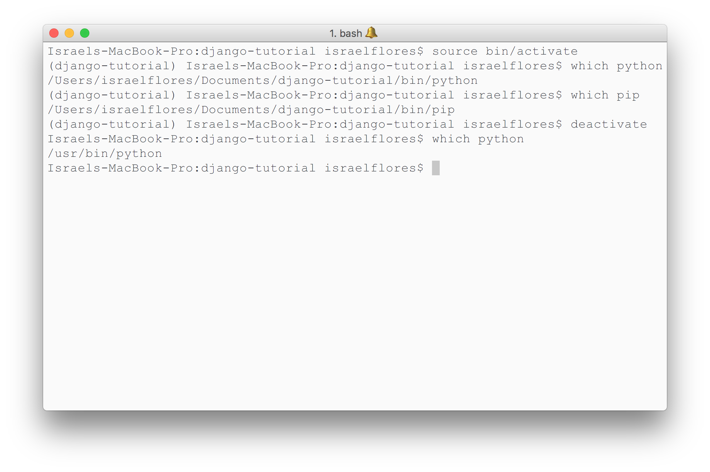
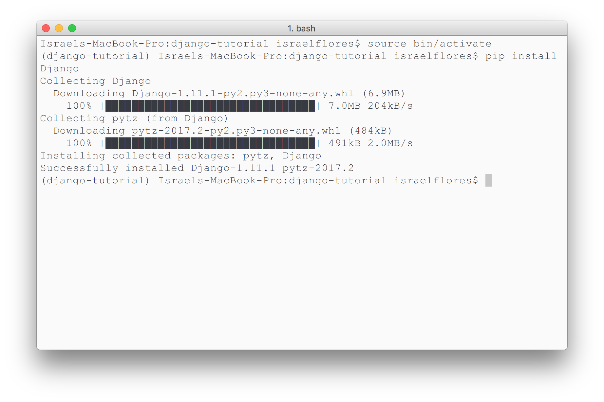

<h1 align="center">Django Tutorial</h1>

### My personal repository to learn Django from [DjangoProject.com](https://docs.djangoproject.com/en/1.11/intro/)

<br>

<h2 align="center">Using <code>virtualenv</code></h2>

(note: used as a "container" environment for the project)

### Install

```bash
sudo pip install virtualenv
```

### Start a new `virtualenv` "container"

```bash
virtualenv directory/name
```

To use Python3 instead:

```bash
virtualenv -p Python3 directory/name
```

### Usage

#### activate

```bash
source bin/activate
```

#### deactivate

```bash
deactivate
```

#### example

notice how, while activated, python and pip point to the packages defined inside the environment:




<h2 align="center">Install Django</h2>

With `virtualenv` [activated](#usage), run the following command:

```bash
pip install Django
```

#### example




<h2 align="center">The Django Project Tutorial</h2>

Tutorial Reference: [https://docs.djangoproject.com/en/1.11/intro/tutorial01/](https://docs.djangoproject.com/en/1.11/intro/tutorial01/)

<br>

### Start a new Django project

```bash
django-admin startproject nameOfYourSite
```

<br>

### Models and Database Migration

from: [https://docs.djangoproject.com/en/1.11/intro/tutorial02/#activating-models](https://docs.djangoproject.com/en/1.11/intro/tutorial02/#activating-models)

_**The 3-Step Guide to Model Changes**_
* _**change**_ your models (in `models.py`)
* run `python manage.py makemigrations` to _**create**_ migration for those changes
* run `python manage.py migrate` to _**apply**_ those changes to the databases

<br>

### Django/Python3 Shell (important)

Rather than calling `python` in our `virtualenv`, we use

```bash
python manage.py shell
```

`manage.py` will set "the DJANGO_SETTINGS_MODULE environment variable, which gives Django the Python import path to your mysite/settings.py file."
